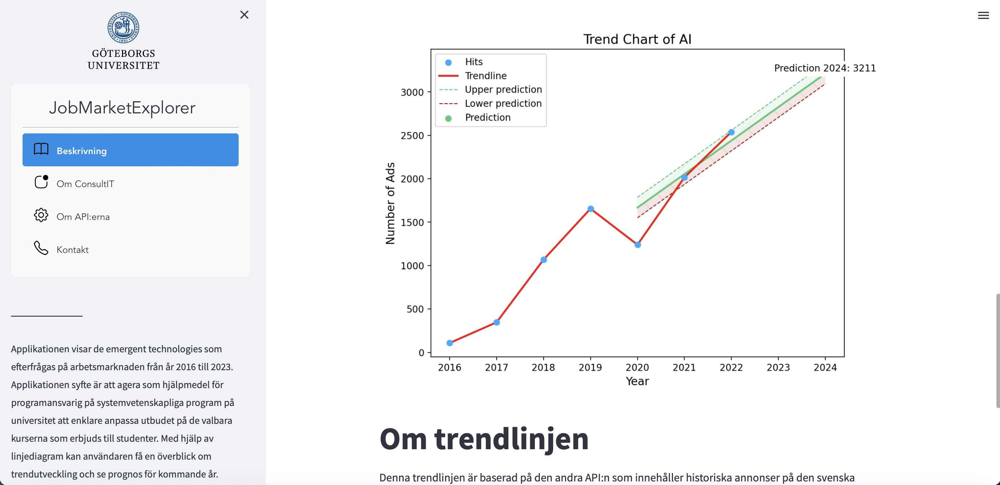

# JobMarketExplorer - A Python web applicaiton.
## Overview

This application is designed to provide insights into the dynamic trends within the job marketplace, with a specific focus on job positions and technologies within the IT and tech industry. Our goal is to offer a user-friendly platform for analyzing trends within the tech job market.

Developed by me during my freshman year in University, this application is built using Python and Streamlit, leveraging APIs to fetch real-time data from the publicly available resources at https://data.jobtechdev.se.

## Features:

- **Market Trends:** Explore the latest trends in job positions and emerging technologies within the IT and tech industry.

- **Data Source:** The application retrieves data from the comprehensive and up-to-date public APIs provided by https://data.jobtechdev.se.

- **Python Powered:** Built using Python, ensuring a robust and versatile foundation for seamless functionality and future enhancements.

## Screenshots
 

## How to Use:

1. **Clone the Repository:**
   ```
   git clone https://github.com/LudwigJL/jobmarketexplorer
   cd JobMarketExplorer
   ```

2. **Install Dependencies:**
   ```
   pip install -r requirements.txt
   ```

3. **Run the Application:**
   ```
   python3 main.py
   ```

4. **Explore and Analyze:**
   Open your web browser and navigate to http://localhost:5000 to start exploring the trends in the IT and tech job marketplace.

## Happy exploring!
